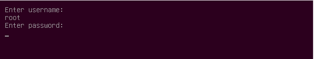

#GRUB的權限和授權

Bootloader的預設應該是只要使用者可以取得實體的console的話，任何人都可以存取，而且任何人都可以選擇和編輯『menu entry』，而且任何人都可以直接存取GRUB的shell prompt。

對於大部分的系統來說，像這樣只要你能實體存取GRUB的話，確實可以取得任何權限是很合理的，如果使用GRUB這個boot loader level 還要先取得授權的話，如果想要復原損壞的系統還要這樣真的是很麻煩。但是在有些環境，像是kiosks，就需要在執行某些功能前需要取得權限才行。

命令『password』和『password_pbkdf2』可以在定義使用者和其密碼。『password』的話設定的密碼是明碼，而且你的『grub.cfg』是需要被保護的; 而『password_pbkdf2』則是使用Password-Based Key Derivation Function (RFC 2898)來加密你的密碼，這部份的使用需要在Linux系統上使用命令『grub-mkpasswd-pbkdf2』來產生。

為了在GRUB上啟用權限機制，第一件事就是要設定環境變數『superusers』，多個使用者名稱的話可以用空白，逗號(,)，分號(;)，pipe(|)或是ampersands(&)來區隔。superuser可以使用GRUB的command line，編輯menu entry和執行任何的menu entry。相對而言，如果你有設定『superuser』的話，則當然command line就會限制一般使用者的使用。

在有設定權限的條件下，一般使用者可以使用特定的menu entry，條件是這些特殊的menu entry上有標注option 『--users』，所以相對而言，如果沒有設定這個option『--user』的話，就只有superuser才能使用這個menu entry。

那有沒有辦法讓某個menu entry完全不受到限制，每個人都可以使用呢?當然可以，只要在menu entry使用option 『--unrestricted 』就可以了，就不會有任何限制。

如果將上面的所有例子都放在一起的話，『grub.cfg』會如下面這個例子:

```
set superusers="root"
password_pbkdf2 root grub.pbkdf2.sha512.10000.biglongstring
password user1 insecure

menuentry "May be run by any user" --unrestricted {
	set root=(hd0,1)
	linux /vmlinuz
}

menuentry "Superusers only" --users "" {
	set root=(hd0,1)
	linux /vmlinuz single
}

menuentry "May be run by user1 or a superuser" --users user1 {
	set root=(hd0,2)
	chainloader +1
}
```
可以看到設定了一個superuser - 『root』，然後有另一個user - 『user1』，


```
# grub-mkpasswd-pbkdf2
Enter password:
Reenter password:
PBKDF2 hash of your password is grub.pbkdf2.sha512.10000.FAF2D97BAF03AD14CF1273A55898C3C0A565B26B8703C97B8733B2DC3430F1A35C3234D821AC99EACF16BBA3039392C57D3DEAEDFFCB9E81C893157F4CD6962B.8677D96E17F07B898624627224A0C6FAF7D63EBE8B5A2B61ED98C641C211F8DDA0DF58EB484FD6D845B9466C3E9177437264C3F7D469E3E2BB7E589AC35AEBC1
```


在Linux的命令『grub-mkconfig』並沒有內建產生有權限的組態檔這個功能，所以你必須在『/etc/grub.d/40_custom』裡面加入簡單的superuser權限，只要在這個檔案裡面加入『set superusers=』，還有命令『password』或是『password_pbkdf2 』。



