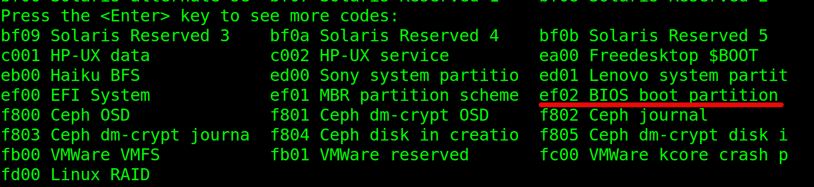

# MBR
在傳統PC BIOS平台所使用的『partition table』格式叫做『Master Boot Record(MBR)』，這個格式主要就是四個『primary partitions』和額外的『logical partitions』所組成的。而在這種格式之下，有兩種方式可以安裝GRUB：

1. GRUB可以被嵌在MBR和第一個partition之間的區域，這部份有好多種名字，像是『MBR gap』，『embedding area』，『boot track』等等，而且通常都只有31KiB。

2. core image可以被安裝到一個file system裡面，又或者是可以被安裝到一系列的blocks裡面，這兩種方式都要能確保可以在這個partition的第一個sector裡。

上面的兩種方式都有其缺點，第一種的話，主要是放置在embedding area並無法保證這個保留區域是絕對安全的，或者有可能會被其他的軟體所覆寫掉，又或者是系統有時候在建制partition的時候沒有在第一個partition留有足夠的空間等等問題。第二種方式就很有可能被一些filesystem的功能所影響，像是『tail packing』還是『fsck』等等會去影響到block的功能，所以其實依賴於filesystem的作法其實也是很脆弱的。並且第二種方式也只能用在『/boot』和BIOS開機的硬碟是同一顆的狀態下才能用。

GRUB的研發團隊通常會建議將GRUB嵌在第一個partition之前，你必須確保第一個partition至少會是在磁碟一開始的31 KiB(63 sectors)之後;但是現在的硬碟因為效能的關係，所以可以將第一個partition給擴充到1 MiB的地方比較好。

# GPT
現在一些比較新的系統都會使用GUID Partition Table (GPT)格式，這種格式被稱為是部份的Extensible Firmware Interface (EFI)，但是只要系統平台支援的話，BIOS平台也可以使用(GRUB/GNU Linux就可以支援)。如果是使用這種格式的話，系統就會保留整個partition給GRUB，這個partition就會被稱為『BIOS Boot Partition』。所以如果GRUB被嵌在這個partition裡面的話，就不必擔心被其他軟體所覆寫還是被filesystem的功能所影響到了。

當你要在GPT系統要建立BIOS Boot Partiton的話，你要確保他的容量至少要31 KiB，但是因為GPT-格式的磁碟通常都不小，所以官方建議你保留的容量要比31 KiB還要大，像是1 MiB左右。

並且你要確保它有個適當的partition type，要作到這一點，底下用兩個工具來講:

1. 如果你要使用GNU Parted程式的話，使用底下命令:


```
# parted /dev/disk set partition-number bios_grub on
```
2. 如果是使用gdisk的話，就要把partition type設定成『0xEF02』(如下圖)。或者是如果要直接設定GUID的話，就把它設定成『21686148-6449-6e6f-744e656564454649』。這邊要特別注意你選擇的partition，因為在安裝過程中，如果GRUB有找到BIOS Boot Partition的話，會自動的把它覆寫掉。



