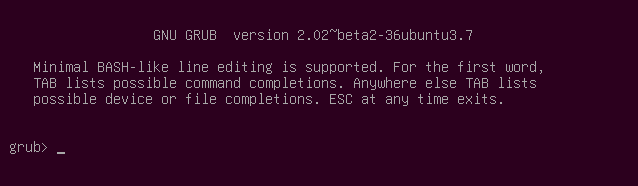

像之前有講過的，如果你的GRUB開機失敗直接進入concole mode的話代表已經讀取各個module，也應該已經找到相關的啟動資訊，但是無法找到組態檔。

# 如果有『grub.cfg』
使用『search』和『set』來確認你的路徑和環境變數，然後檢查你的『/boot/grub』裡面是否有『grub.cfg』，又或者名字錯誤，如果名字錯誤的話，或者是你有其他的『.cfg』檔案的話，請使用底下的命令讀取其組態，當然你要自己置換路徑跟檔名，不要直接複製貼上了：
configfile /boot/grub/grub.cfg 或者是 configfile (hdX,Y)/boot/grub/grub.cfg

正常來說，如果以上的命令執行成功了，你的電腦應該就會出現menu entry讓你選擇，開機後，記得去修改相對應的檔案，然後執行『update-grub』更新組態。

# 手動開機
上面的例子是有『grub.cfg』的話，你還可以利用這個組態，那如果你的狀態是沒有這個組態的話，就要自己手動設定開機了，像之前說過得，GRUB只要知道你的『prefix』，『root』，『kernel』和『initrd』的話，它就有辦法開機，步驟如下：

(一樣，在強調一下。在底下的所有例子中，『X』就是硬碟代號，『Y』則是partition number，記得要根據你自己的狀況帶入相關的值)。

1.	設定『root』
這個變數必須指到Ubuntu安裝的硬碟和partition上。
set root=(hdX,Y)
2.	設定『prefix』
set prefix=(hdX,Y)/boot/grub
3.	設定『kernel』
可以使用『root』底下的kernel捷徑，如果沒有捷徑的話請使用全路徑，通常是在『/boot』底下
 linux /vmlinuz root=/dev/sdXY ro
4.	設定『initrd』
選擇最新的initrd image，跟kernel一樣，可能會在『root』底下會有捷徑，沒有的話也應該要在『/boot底下找到』。
initrd /initrd.img
5.	以剛才的設定啟動
boot

成功啟動後，記得去修改相對應的檔案，然後執行『update-grub』更新組態。
如果有需要的話也可以執行『grub-install』或是『boot-repair』來重新安裝GRUB。

