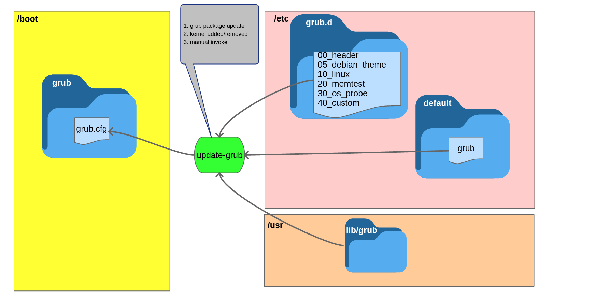
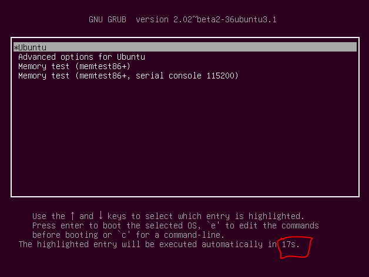
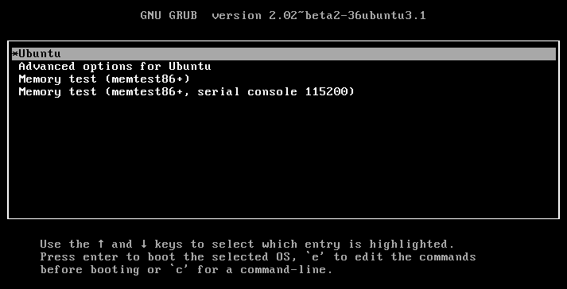

# 組態結構

GRUB最主要的組態主要是『grub.cfg』，通常是在『/boot/grub』底下，這個檔案會一直很常在變動，通常大部份的使用者不需要自己去動到這個檔案。

如下圖所示，組態的更新主要由『update-grub』來觸發：
1. 當GRUB套件被自動更新時。
2. Linux kernel被更新時。
3. 使用使用者權限呼叫『update-grup』時。



這個指令被觸發後，它會去執行在『/etc/grub.d/』裡面的script和『/etc/default/grub』裡面的設定，並且還有將『/usr/lib/grub』裡面相關的模組和image給複製過去。


## menu : /boot/grub/grub.cfg
grub.cfg是用來取代GRUB 0.97的menu.lst，這個檔案包含了GRUB2的menu 資訊，但是它不像GRUB 0.97的 menu.lst一樣通常可以直接修改，就像上面有提到的，這個檔案是上面各個部份的輸出，而各個部份都負責不一樣的功能。

這個檔案你實際去看會分很多個section，每個section都會使用『###BEGIN###』開始，和使用『###END###』結束，代表的是每個『/etc/grub.d』底下的檔案。

在早期的GRUB2版本，這個檔案其實是唯讀的，即使連『root』也不例外，但是因為開發者發現有時候簡單的改變這個檔案會對使用者比較方便，所以後來就開放可以編輯，這部份使用者自己要了解的是，當你或系統執行『update-grub』時，之前的修改又會被覆寫掉就對了，所以，最好還是由上圖的流程去修改你要的檔案，在執行『update-grub』會比較正規。而且官方上面還有說如果你自己手動修改的話，有可能造成『update-grub』執行時會造成更新出問題，導致無法更新grub.cfg，所以再次強調，可以的話還是照正規途徑修改吧。

## 使用者設定: /etc/default/grub
這個組態檔包含了之前舊版的menu.lst裡面的資訊，主要就是一些額外的環境變數，像是『backgrounds』和『theme』之類的，還有要傳給kernel line的參數等等。

## Script : /etc/grub.d/
在這個資料夾裡面的檔案都是script，執行的結果都會輸出到『grub.cfg』裡，也就是說如果你想要你的script結果被輸出到『grub.cfg』的話，你的檔案或是script就必須要是可執行的。

像之前說過的『grub.cfg』裡面的內容會有很多個section，每個section都會以『###BEGIN###』開始，和使用『###END###』結束，這每個section的內容都是在這個資料夾裡面輸出的，至於執行順序的話，因為這個資料夾裡面檔案的格式前面都會有個兩碼的數字，而執行的順序會以這個數字為主，數字越低的越先執行，像是『10_linux』就會比 『20_memtest』還要快執行，如果有開頭非數字的script的話，則這個檔案就會在所有數字開頭的script執行完以後才會執行。

這個資料夾裡面主要的檔案描述如下：


### 00_header

### 05_debian_theme

### 10_linux

### 20_memtest86+

### 30_os-prober

### 40_custom


底下先來探討一個比較簡單的設定。


# Simple configuration
『grub-mkconfig』所產生的『grub.cfg』適用在很多的case，當你的distro upgrade時，系統會自動的幫你抓到最新的kernel並且自動產生『menu entry』。

檔案『/etc/default/grub』控制了『grub-mkconfig』的功能，這個檔案會由Shell Script所套用，所以記得必須遵守POSIX的Shell input，裡面的值都只是一堆的『KEY=value』，如果值有空白字元或是其它的特殊字元的話，則必須用引號『""』來處理，像是:

```
GRUB_TERMINAL_INPUT="console serial"
```

底下列出所有可用的『KEY』和其說明:

- GRUB_DEFAULT<br>
設定預設的menu entry，可以是一個數字，或者是menu entry的標頭，如果是數字的話，代表的是從0開始數的menu entry編號；如果你的menu entry很多的話，建議可以直接用你的menu entry的標頭就好，不然你還要在那邊數，很麻煩。
舉例來說，如果你有個menu entry如下:
```
menuentry 'Example GNU/Linux distribution' --class gnu-linux {
	...
}
```
那你的GRUB_DEFAULT就變成:

```
GRUB_DEFAULT='Example GNU/Linux distribution'
```
除了以上兩種可能以外 - 『數字』和『標頭』以外，還有第三種，就是可以把它設定成『saved』，這個選項主要是藉由選項『GRUB_SAVEDEFAULT』來儲存預設的menu entry，預設的數字是『0』，除了由『GRUB_SAVEDEFAULT』選項來自動儲存以外，你也可以用grub-set-default或是grub-reboot。

- GRUB_SAVEDEFAULT <br>
如果這個選項是被設定成『true』，當你在開機選擇menu entry時，GRUB會將你的選擇儲存起來，這樣下一次開機的預設就會變成這個，接下來，底下兩個說明會有點饒舌，『GRUB_SAVEDEFAULT』只有在『GRUB_SAVEDEFAULT=saved』時有用，但是這又是兩個分開的選項，因為如果伴隨著『grub-set-default』或是『grub-reboot』的話，『GRUB_DEFAULT=saved』只有在沒有『GRUB_SAVEDEFAULT』的狀況才有效。這個選項預設是不啟用，而且依賴於『environment block』，所以可能不適用於所有的case。

- GRUB_TIMEOUT <br>
這個選項主要就是在控制進入menu後會倒數幾秒，預設的話是『5』秒; 如果設定成『0』的話，代表直接用預設選項不進入menu; 設定成『-1』的話，代表會停在menu處一直等下去。如果這個值為非0的話，就不該啟用『GRUB_HIDDEN_TIMEOUT』，但是如果你『GRUB_TIMEOUT』設定為非0值，但是你的『GRUB_HIDDEN_TIMEOUT』也有設定的話，則只會看到menu出現之前的倒數，不會看到menu的倒數。



- GRUB_HIDDEN_TIMEOUT <br>
上一個選項是『GRUB_TIMEOUT』，主要是在定義menu出現"後"要倒數幾秒，如果倒數完之前沒有按任何鍵的話，將會直接以預設的選項開機。這個選項則是相反，主要是設定menu出現"前"會倒數幾秒，如果將這個選項直接設定成『0』的話，將不會倒數，除非你直接按某些特定的鍵才會顯示，在Ubuntu裡面則是用『Shift』。


- GRUB_HIDDEN_TIMEOUT_QUIET <br>
通常會跟『GRUB_HIDDEN_TIMEOUT』一起共用，
	- 如果將這個設定成『true』的話，將不會顯示倒數計時器。
	- 設定成『false』的話則會顯示，但是我在Ubuntu上面怎麼設定都是false就對了。

- GRUB_DEFAULT_BUTTON <br>
- GRUB_TIMEOUT_BUTTON  <br>
- GRUB_HIDDEN_TIMEOUT_BUTTON <br>  
- GRUB_BUTTON_CMOS_ADDRESS  <br>
有些筆電(laptop)的供應商會在啟動特定的作業系統時，提供額外的開機按鈕，像是『Asus EeePC 1005PE』，『Dell XPS M1530』等等，而GRUB也支援這部份的需求，這部分的需求請直接看手冊，主要是藉由在這個地方寫入CMOS裡的位址。

- GRUB_DISTRIBUTOR <br>
主要由你的GRUB的distro來設定這個選項，把它設定成他們的辨識名稱，這樣通成會在menu entry 標題的部份產生更多的資訊。

- GRUB_TERMINAL_INPUT<br>
選擇終端機(terminal)的輸入裝置，當然你可以在這邊選擇多重的裝置，中間請用空白隔開。有效的terminal輸入名稱其實取決於你的平台，但是通常會有以下的幾個(預設都是使用系統原生的terminal輸入):
	- console (PC BIOS 和 EFI consoles)
	- serial (serial terminal)
	- ofconsole (Open Firmware console)
	- at_keyboard (PC AT keyboard, 主要會用在Coreboot)
	- usb_keyboard (主要是使用HID boot protocol的USB鍵盤，這部分是以防firmware沒有去處理這部分)。

- GRUB_TERMINAL_OUTPUT <br>
選擇終端機(terminal)的輸出裝置，當然你可以在這邊選擇多重的裝置，中間請用空白隔開。有效的terminal輸出名稱其實取決於你的平台，但是通常會有以下的幾個(預設都是使用系統原生的terminal輸出):
	- console (PC BIOS 和 EFI consoles)
	- serial (serial terminal)
	- gfxterm (graphics-mode output)
	- ofconsole (Open Firmware console)
	- vga_text (VGA text output, 主要是用在Coreboot).

底下舉個例子，將OUTPUT改成console的話，圖型化介面就會變成底下這樣:


- GRUB_TERMINAL <br>
	- 如果有設定這個選項，則會將『GRUB_TERMINAL_INPUT』和『GRUB_TERMINAL_OUTPUT』覆寫成相同的值。像是:
	`GRUB_TERMINAL=console` <br>
	統一將input和output都設定成console

- GRUB_SERIAL_COMMAND <br>
如果你的GRUB想要使用serial console的話就要設定這個serial port，語法的話後面的章節會介紹。

- GRUB_CMDLINE_LINUX <br>
要加入到menu entry的Command-line的參數，不論是一般或者是救援模式，主要是傳給kernel的。

- GRUB_CMDLINE_LINUX_DEFAULT <br>
一般除非『GRUB_DISABLE_RECOVERY』設定成true，不然通常會有兩個menu entry出現 -『預設』和『救援模式』，而這個選項主要就是傳給那『預設』的開機選項的參數，不會傳給『救援模式』。

- GRUB_CMDLINE_NETBSD <br>
- GRUB_CMDLINE_NETBSD_DEFAULT <br>
就像是『GRUB_CMDLINE_LINUX』和『GRUB_CMDLINE_LINUX_DEFAULT』，但是是給NetBSD用的。

- GRUB_CMDLINE_GNUMACH <br>
就像是『GRUB_CMDLINE_LINUX』，但是是給GNU Mach用的。

- GRUB_CMDLINE_XEN <br>
- GRUB_CMDLINE_XEN_DEFAULT <br>
這兩個選項的參數會在Linux和Xen menu entry的case之下依附於『GRUB_CMDLINE_LINUX』和『GRUB_CMDLINE_LINUX_DEFAULT』的參數後面。

- GRUB_CMDLINE_LINUX_XEN_REPLACE <br>
- GRUB_CMDLINE_LINUX_XEN_REPLACE_DEFAULT <br>
這兩個選項的參數將會在Linux和Xen menu entry的case之下將GRUB_CMDLINE_LINUX』和『GRUB_CMDLINE_LINUX_DEFAULT』的參數取代掉。

- GRUB_DISABLE_LINUX_UUID <br>
一般來說，grub-mkconfig會為menu entry建立『universally-unique identifiers (UUIDs)』，讓kernel辨識系統的檔案系統，這部分可以使用語法『root=UUID=...』kernel參數的方式來描述，通常這種方式會比較可以信賴。將這個參數設定成true來關閉這個功能。

- GRUB_DISABLE_RECOVERY <br>
如果這個選項設定成『true』，則在menu上不顯示救援模式(recovery mode)。

- GRUB_VIDEO_BACKEND
通常如果需要顯卡的支援的話，就代表你在使用『gfxterm』圖形化終端機，或者是選項『GRUB_GFXPAYLOAD_LINUX』被啟動了，這樣grub-mkconfig將會讀取所有的GRUB的Video driver，並且使用一個最匹配你硬體的driver。但是通常不太需要動到這個參數，除非你有特殊需求。在『grub-install』執行以後，可取得的video driver清單都會在『/boot/grub/video.lst』。

- GRUB_GFXMODE <br>
如果你是使用『gfxterm』圖形化終端機的話，這個選項可以設定其解析度。這邊要特別注意的是這個選項只能用在你的顯卡支援VESA BIOS Extensions (VBE)的狀況之下才能用，預設的選項是『auto』，在接下來的內容裡會解釋一下這些參數。

- GRUB_BACKGROUND <br>
如果你是使用『gfxterm』圖形化終端機的話，可以透過這個選項來設定背景圖片，但是這些圖片的路徑必須在開機時被GRUB讀到才行，格式必須要是.png, .tga, .jpg, or .jpeg。如果有需要的話，GRUB會自動重新調整圖片來填滿螢幕。

- GRUB_THEME <br>
如果你是使用『gfxterm』圖形化終端機的話，這個參數可以設定主題。

- GRUB_GFXPAYLOAD_LINUX <br>
如果將這個選項設定成『text』的話記會強制將kernel給啟動到文字模式(text mode)；如果是設定成『keep』，則將會繼續保持在『graphic』模式。這個選項要取決於你的kernel，distro，顯卡，任何以種組合都有可能在早期的啟動流程讓你的顯卡遇到一些問題。如果真的遇到問題的話，就直接把這個模式設定成『text』就好了。


- GRUB_DISABLE_OS_PROBER <br>
一般來說，grub-mkconfig會試著使用外部的作業系統偵測程式(os-prober)來偵測在同一個系統裡安裝的作業系統，並且產生適當的menu entry，如果將這個設定成true的話則會關閉這個功能。

- GRUB_INIT_TUNE <br>
當GRUB開始時，主機板會出逼聲，通常在使用者無法直接看到螢幕時很有用，這部分主要是透過一個程式叫做『play』去實做的。

- GRUB_BADRAM <br>
如果這個選項有被設定的話，GRUB將會發起一個badram的命令，這個命令會將RAM裡面某些特定區域給濾掉，代表這些區域已經毀損。

- GRUB_PRELOAD_MODULES <br>
這個選項可以被設定成一系列的GRUB module(模組)，每個module的名稱都用空白所隔開，設定以後，在grub.cfg開始的時候，會盡快的去讀取這個些module。


