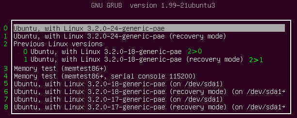

# /etc/default/grub的所有可用參數

『grub-mkconfig』所產生的『grub.cfg』適用在很多的case，通常都是當你所用的distro(發行板) upgrade時，系統會自動的幫你抓到最新的kernel並且自動產生『menu entry』。

檔案『/etc/default/grub』控制了『grub-mkconfig』的功能，這個檔案會由Shell Script所套用，所以記得必須遵守POSIX的Shell input，裡面的值格式就是一堆的『KEY=value』，如果值有空白字元或是其它的特殊字元的話，則必須用引號『"    "』來處理，像是:
```
GRUB_TERMINAL_INPUT="console serial"
```
一開始先列出所有KEY的索引：
- <a href="#GRUB_DEFAULT">GRUB_DEFAULT</a>
- <a href="#GRUB_SAVEDEFAULT">GRUB_SAVEDEFAULT</a>
- <a href="#GRUB_TIMEOUT">GRUB_TIMEOUT</a>
- <a href="#GRUB_HIDDEN_TIMEOUT">GRUB_HIDDEN_TIMEOUT</a>
- <a href="#GRUB_HIDDEN_TIMEOUT_QUIET">GRUB_HIDDEN_TIMEOUT_QUIET</a>
- <a href="#GRUB_BUTTON_CMOS_ADDRESS">GRUB_DEFAULT_BUTTON</a>
- <a href="#GRUB_BUTTON_CMOS_ADDRESS">GRUB_TIMEOUT_BUTTON</a>
- <a href="#GRUB_BUTTON_CMOS_ADDRESS">GRUB_HIDDEN_TIMEOUT_BUTTON</a>
- <a href="#GRUB_BUTTON_CMOS_ADDRESS">GRUB_BUTTON_CMOS_ADDRESS</a>
- <a href="#GRUB_DISTRIBUTOR">GRUB_DISTRIBUTOR</a>
- <a href="#GRUB_TERMINAL_INPUT">GRUB_TERMINAL_INPUT</a>
- <a href="#GRUB_TERMINAL_OUTPUT">GRUB_TERMINAL_OUTPUT</a>
- <a href="#GRUB_TERMINAL">GRUB_TERMINAL</a>
- <a href="#GRUB_SERIAL_COMMAND">GRUB_SERIAL_COMMAND</a>
- <a href="#GRUB_CMDLINE_LINUX">GRUB_CMDLINE_LINUX</a>
- <a href="#GRUB_CMDLINE_LINUX_DEFAULT">GRUB_CMDLINE_LINUX_DEFAULT</a>
- <a href="#GRUB_CMDLINE_NETBSD_DEFAULT">GRUB_CMDLINE_NETBSD</a>
- <a href="#GRUB_CMDLINE_NETBSD_DEFAULT">GRUB_CMDLINE_NETBSD_DEFAULT</a>
- <a href="#GRUB_CMDLINE_GNUMACH">GRUB_CMDLINE_GNUMACH</a>
- <a href="#GRUB_CMDLINE_XEN_DEFAULT">GRUB_CMDLINE_XEN</a>
- <a href="#GRUB_CMDLINE_XEN_DEFAULT">GRUB_CMDLINE_XEN_DEFAULT</a>
- <a href="#GRUB_CMDLINE_LINUX_XEN_REPLACE_DEFAULT">GRUB_CMDLINE_LINUX_XEN_REPLACE</a>
- <a href="#GRUB_CMDLINE_LINUX_XEN_REPLACE_DEFAULT">GRUB_CMDLINE_LINUX_XEN_REPLACE_DEFAULT</a>
- <a href="#GRUB_DISABLE_LINUX_UUID">GRUB_DISABLE_LINUX_UUID</a>
- <a href="#GRUB_DISABLE_RECOVERY">GRUB_DISABLE_RECOVERY</a>
- <a href="#GRUB_VIDEO_BACKEND">GRUB_VIDEO_BACKEND</a>
- <a href="#GRUB_GFXMODE">GRUB_GFXMODE</a>
- <a href="#GRUB_BACKGROUND">GRUB_BACKGROUND</a>
- <a href="#GRUB_THEME">GRUB_THEME</a>
- <a href="#GRUB_GFXPAYLOAD_LINUX">GRUB_GFXPAYLOAD_LINUX</a>
- <a href="#GRUB_DISABLE_OS_PROBER">GRUB_DISABLE_OS_PROBER</a>
- <a href="#GRUB_INIT_TUNE">GRUB_INIT_TUNE</a>
- <a href="#GRUB_BADRAM">GRUB_BADRAM</a>
- <a href="#GRUB_PRELOAD_MODULES">GRUB_PRELOAD_MODULES</a>

底下則列出所有可用的『KEY』和其說明:
<a id="GRUB_DEFAULT"></a>
## GRUB_DEFAULT<br>
設定預設的menu entry，可以是一個數字，或者是menu entry的標頭，或是『saved』。

1.**GRUB_DEFAULT=0**<br>
如果是數字的話，代表的是從0開始數的menu entry編號；如果你的menu entry很多的話，建議可以直接用你的menu entry的標頭就好，不然你還要在那邊數，很麻煩。

	從GRUB 1.99開始，在menu的結構裡面引入了submenu，在submenu裡面的entry都會變成兩碼，第一個entry是在主要menu的submenu標題位置，第二個entry則是submenu裡面的位置，底下一個例子，假設我有一個submenu是在第三個主要entry底下的第一個，如下圖一樣，則設計就會是『2>0』。

	<br>
	(Picture from https://help.ubuntu.com/community/Grub2/Setup )<br>
	(之前舊版的叫做『Previous Linux versions』，但是後來GRUB2.0以後就變成『Advanced options...』)
	
	對於上面這個case，下面這四種表示法都可以:
```
	1. GRUB_DEFAULT="Previous Linux versions>Ubuntu, with Linux 3.2.0-18-generic-pae"
	2. GRUB_DEFAULT="Previous Linux versions>0"
	3. GRUB_DEFAULT="2>0"
	4. GRUB_DEFAULT="2>Ubuntu, with Linux 3.2.0-18-generic-pae"
```

如果你給『GRUB_DEFAULT』有誤的話，可能會造成GRUB2無法決定到底要以哪一個kernel開機，這時候GRUB2預設就會以第一個主要的entry，也就是最新的kerenl開機。


2.**GRUB_DEFAULT="xxxx"**<br>
給一個包含『" "』切確的標題名稱，用名稱的話，預設的位置就不用管了。舉例來說，如果你有個menu entry如下:
```
menuentry 'Example GNU/Linux distribution' --class gnu-linux {
	...
}
```
那你的GRUB_DEFAULT就變成:
```
GRUB_DEFAULT='Example GNU/Linux distribution'
```

	如果是要用剛剛submenu的圖的『2>0』的話，GRUB_DEFAULT就會是：
```
GRUB_DEFAULT="2>Ubuntu, with Linux 3.2.0-18-generic-pae"
```

3.**GRUB_DEFAULT=saved**<br>
這個選項是在GRUB 1.98後開始啟用的，主要是藉由選項『GRUB_SAVEDEFAULT』來儲存預設的menu entry，預設的數字是『0』，除了由『GRUB_SAVEDEFAULT』選項來自動儲存以外，你也可以用『grub-set-default』或是『grub-reboot』。『GRUB_SAVEDEFAULT』的說明請看下一個命令，『grub-set-default』和『grub-reboot』請直接看章節『Commands-System』。

<a id="GRUB_SAVEDEFAULT"></a>
## GRUB_SAVEDEFAULT <br>
如果這個選項是被設定成『true』，當你在開機選擇任何一個menu entry時，GRUB會將你的選擇儲存起來，這樣下一次開機的預設就會變成這個，接下來，底下兩個說明會有點饒舌，『GRUB_SAVEDEFAULT』只有在『GRUB_DEFAULT=saved』時有用，但是這又是兩個分開的選項，因為如果伴隨著『grub-set-default』或是『grub-reboot』的話，『GRUB_DEFAULT=saved』只有在沒有『GRUB_SAVEDEFAULT』的狀況才有效。這個選項預設是不啟用，而且依賴於『environment block』，所以可能不適用於所有的case。<span>而且根據Ubuntu的官方文件說，如果你的『/boot』是在LVM或是RAID的話，這個選項是不能用的。</span>

<a id="GRUB_TIMEOUT"></a>
## GRUB_TIMEOUT <br>
這個選項主要就是在控制進入menu後會倒數幾秒，預設的話是『5』秒; 

- **GRUB_TIMEOUT = 0**
如果設定成『0』的話，代表直接用預設選項不進入menu; 

- **GRUB_TIMEOUT = -1**
設定成『-1』的話，代表會停在menu處一直等下去，直到使用者做出選擇為止。

- 如果這個值為非0的話，就不該啟用『GRUB_HIDDEN_TIMEOUT』，但是如果你『GRUB_TIMEOUT』設定為非0值，而你的『GRUB_HIDDEN_TIMEOUT』也有設定的話，則只會看到menu出現之前的倒數，不會看到menu的倒數。因為GRUB的工程師當初的設計其實是這個選項是跟『GRUB_HIDDEN_TIMEOUT』是互斥的，其實蠻合理的，只要倒數一次就好，用途就是要讓使用者有時間去決定你要進入那一個entry，不需要兩次倒數。

- 在單作業系統上，預設這個選項是沒用的，代表你的menu不會出現，要讓menu顯示的話就應該要將『GRUB_HIDDEN_TIMEOUT』給註解掉，然後讓這個選項的值為1或以上。


<a id="GRUB_HIDDEN_TIMEOUT"></a>
## GRUB_HIDDEN_TIMEOUT <br>
上一個選項是『GRUB_TIMEOUT』，主要是在定義menu出現"後"要倒數幾秒，如果倒數完之前沒有按任何鍵的話，將會直接以預設的選項開機。這個選項則是相反，主要是設定menu出現"前"會倒數幾秒。

- **GRUB_HIDDEN_TIMEOUT=0**
如果將這個選項直接設定成『0』的話，將不會倒數，除非你直接按某些特定的鍵才會顯示，在Ubuntu裡面則是用『Shift』。

- **GRUB_HIDDEN_TIMEOUT=5**
如果後面接的是合理的正整數的話，則將會倒數(如下圖所示)，中間如果你按下任何鍵就會顯示menu entry，倒數完之前都沒按任何鍵的話，就會直接以預設的entry開機。

- **GRUB_HIDDEN_TIMEOUT=** 
如果等號後面沒有任何數值的話，則倒數的秒數將會從『GRUB_TIMEOUT』的值那邊拿來用。


<a id="GRUB_HIDDEN_TIMEOUT_QUIET"></a>
## GRUB_HIDDEN_TIMEOUT_QUIET <br>
通常會跟『GRUB_HIDDEN_TIMEOUT』一起共用，
	- 如果將這個設定成『true』的話，將不會顯示倒數計時器。
	- 設定成『false』的話則會顯示倒數計時器，但是我在Ubuntu上面怎麼設定都是false就對了。

## GRUB_DEFAULT_BUTTON <br>
## GRUB_TIMEOUT_BUTTON  <br>
## GRUB_HIDDEN_TIMEOUT_BUTTON <br>  
<a id="GRUB_BUTTON_CMOS_ADDRESS"></a>
## GRUB_BUTTON_CMOS_ADDRESS  <br>
有些筆電(laptop)的供應商會在啟動特定的作業系統時，提供額外的開機按鈕，像是『Asus EeePC 1005PE』，『Dell XPS M1530』等等，而GRUB也支援這部份的需求，這部分的需求請直接看手冊，主要是藉由在這個地方寫入CMOS裡的位址。

<a id="GRUB_DISTRIBUTOR"></a>
## GRUB_DISTRIBUTOR <br>
主要由你的GRUB的distro來設定這個選項，把它設定成他們的辨識名稱，這樣通成會在menu entry標題的部份產生更多的資訊。

<a id="GRUB_TERMINAL_INPUT"></a>
## GRUB_TERMINAL_INPUT<br>
選擇終端機(terminal)的輸入裝置，當然你可以在這邊選擇多重的裝置，中間請用空白隔開。有效的terminal輸入名稱其實取決於你的平台，但是通常會有以下的幾個(預設都是使用系統原生的terminal輸入):
	- console (PC BIOS 和 EFI consoles)
	- serial (serial terminal)
	- ofconsole (Open Firmware console)
	- at_keyboard (PC AT keyboard, 主要會用在Coreboot)
	- usb_keyboard (主要是使用HID boot protocol的USB鍵盤，這部分是以防firmware沒有去處理這部分)。

<a id="GRUB_TERMINAL_OUTPUT"></a>
## GRUB_TERMINAL_OUTPUT <br>
選擇終端機(terminal)的輸出裝置，當然你可以在這邊選擇多重的裝置，中間請用空白隔開。有效的terminal輸出名稱其實取決於你的平台，但是通常會有以下的幾個(預設都是使用系統原生的terminal輸出):
	- console (PC BIOS 和 EFI consoles)
	- serial (serial terminal)
	- gfxterm (graphics-mode output)
	- ofconsole (Open Firmware console)
	- vga_text (VGA text output, 主要是用在Coreboot).

底下舉個例子，將OUTPUT改成console的話，圖型化介面就會變成底下這樣:


<a id="GRUB_TERMINAL"></a>
## GRUB_TERMINAL <br>
如果有設定這個選項，則會將『GRUB_TERMINAL_INPUT』和『GRUB_TERMINAL_OUTPUT』覆寫成相同的值。像是:<br>
`GRUB_TERMINAL=console` <br>
統一將input和output都設定成console。

有時候如果你的GRUB2的menu太多的話，你可以試著將這個選項直接設定成『GRUB_TERMINAL=console』，直接取消圖形化介面，這樣可能會比較有幫助。

<a id="GRUB_SERIAL_COMMAND"></a>
## GRUB_SERIAL_COMMAND <br>
如果你的GRUB想要使用serial console的話就要設定這個serial port，語法的話後面的章節會介紹。

## GRUB_CMDLINE_LINUX <br>
<a id="GRUB_CMDLINE_LINUX"></a>
要加入到命令『linux』後面的參數，不論是normal模式或者是救援模式都會有此行為，主要是傳參數給kernel的。

<a id="GRUB_CMDLINE_LINUX_DEFAULT"></a>
## GRUB_CMDLINE_LINUX_DEFAULT <br>
一般除非『GRUB_DISABLE_RECOVERY』設定成true，不然通常會有兩個menu entry出現 -『預設(normal mode)』和『救援模式』，跟『GRUB_CMDLINE_LINUX』的差異是，這個選項主要就是傳給那『預設』的命令『linux』的參數，不會傳給『救援模式』。

## GRUB_CMDLINE_NETBSD <br>
<a id="GRUB_CMDLINE_NETBSD_DEFAULT"></a>
## GRUB_CMDLINE_NETBSD_DEFAULT <br>
就像是『GRUB_CMDLINE_LINUX』和『GRUB_CMDLINE_LINUX_DEFAULT』，但是是給NetBSD用的。

<a id="GRUB_CMDLINE_GNUMACH"></a>
## GRUB_CMDLINE_GNUMACH <br>
就像是『GRUB_CMDLINE_LINUX』，但是是給GNU Mach用的。

## GRUB_CMDLINE_XEN <br>
<a id="GRUB_CMDLINE_XEN_DEFAULT"></a>
## GRUB_CMDLINE_XEN_DEFAULT <br>
這兩個選項的參數會在Linux和Xen menu entry的case之下依附於『GRUB_CMDLINE_LINUX』和『GRUB_CMDLINE_LINUX_DEFAULT』的參數後面。

## GRUB_CMDLINE_LINUX_XEN_REPLACE <br>
<a id="GRUB_CMDLINE_LINUX_XEN_REPLACE_DEFAULT"></a>
## GRUB_CMDLINE_LINUX_XEN_REPLACE_DEFAULT <br>
這兩個選項的參數將會在Linux和Xen menu entry的case之下將GRUB_CMDLINE_LINUX』和『GRUB_CMDLINE_LINUX_DEFAULT』的參數取代掉。

## GRUB_DISABLE_LINUX_UUID <br>
<a id="GRUB_DISABLE_LINUX_UUID"></a>
一般來說，grub-mkconfig會為menu entry建立『universally-unique identifiers (UUIDs)』，讓kernel辨識系統的檔案系統，這部分可以使用語法『root=UUID=...』kernel參數的方式來描述，通常這種方式會比較可以信賴。將這個參數設定成true來關閉這個功能。

<a id="GRUB_DISABLE_RECOVERY"></a>
## GRUB_DISABLE_RECOVERY <br>
如果這個選項設定成『true』，則在menu上不顯示救援模式(recovery mode)。

<a id="GRUB_VIDEO_BACKEND"></a>
## GRUB_VIDEO_BACKEND
通常如果需要顯卡的支援的話，就代表你在使用『gfxterm』圖形化終端機，或者是選項『GRUB_GFXPAYLOAD_LINUX』被啟動了，這樣grub-mkconfig將會讀取所有的GRUB的Video driver，並且使用一個最匹配你硬體的driver。但是通常不太需要動到這個參數，除非你有特殊需求。在『grub-install』執行以後，可取得的video driver清單都會在『/boot/grub/video.lst』。

<a id="GRUB_GFXMODE"></a>
## GRUB_GFXMODE <br>
如果你是使用『gfxterm』圖形化終端機的話，這個選項可以設定其解析度。通常GRUB2會自動的幫你設定它覺的最適合的解析度，但是如果你想要自己設定的話，還是可以從這邊設定。這邊要特別注意的是這個選項只能用在你的顯卡支援VESA BIOS Extensions (VBE)的狀況之下才能用，預設的選項是『auto』，在章節『Environment Variable』裡面的『gfxmode』會有更進接的介紹。

<a id="GRUB_BACKGROUND"></a>
## GRUB_BACKGROUND <br>
如果你是使用『gfxterm』圖形化終端機的話，可以透過這個選項來設定背景圖片，但是這些圖片的路徑必須在開機時被GRUB讀到才行，格式必須要是.png, .tga, .jpg, or .jpeg。如果有需要的話，GRUB會自動重新調整圖片來填滿螢幕。這部份的設定會到『splash image』章節在詳細講解。

<a id="GRUB_THEME"></a>
## GRUB_THEME <br>
如果你是使用『gfxterm』圖形化終端機的話，這個參數可以設定主題。

<a id="GRUB_GFXPAYLOAD_LINUX"></a>
## GRUB_GFXPAYLOAD_LINUX <br>
如果將這個選項設定成『text』的話記會強制將kernel給啟動到文字模式(text mode)；如果是設定成『keep』，則將會繼續保持在『graphic』模式。這個選項要取決於你的kernel，distro，顯卡，任何以種組合都有可能在早期的啟動流程讓你的顯卡遇到一些問題。如果真的遇到問題的話，就直接把這個模式設定成『text』就好了。

<a id="GRUB_DISABLE_OS_PROBER"></a>
## GRUB_DISABLE_OS_PROBER <br>
一般來說，grub-mkconfig會試著使用外部的作業系統偵測程式(os-prober)來偵測在同一個系統裡安裝的作業系統，並且產生適當的menu entry，如果將這個設定成true的話則會關閉這個功能。

<a id="GRUB_INIT_TUNE"></a>
## GRUB_INIT_TUNE <br>
當GRUB開始時，主機板會出逼聲，通常在使用者無法直接看到螢幕時很有用，這部分主要是透過一個程式叫做『play』去實做的。menu會等到這些聲音播放完以後才會出現，所以要使用的話請斟酌。詳細訊息請參考『Commands-GRUB』裡面的『play』指令。

<a id="GRUB_BADRAM"></a>
## GRUB_BADRAM <br>
如果這個選項有被設定的話，GRUB將會發起一個badram的命令，這個命令會將RAM裡面某些特定區域給濾掉，代表這些區域已經毀損。

<a id="GRUB_PRELOAD_MODULES"></a>
## GRUB_PRELOAD_MODULES <br>
這個選項可以被設定成一系列的GRUB module(模組)，每個module的名稱都用空白所隔開，設定以後，在grub.cfg開始的時候，會盡快的去讀取這個些module。


