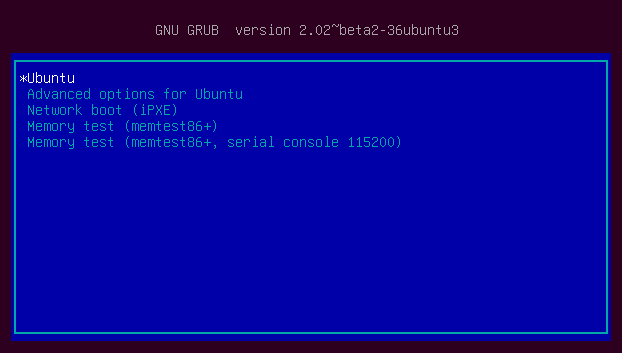

GRUB裡面的環境變數(environment variables)，就像是Unix-like系統一樣，都有個名字，而且是unique的存在，這些變數都可以被set，unset和loooked up。底下介紹一些大概的變數，其中分為兩個部份，第一個部份的變數都對GRUB有特殊的含意，不可以亂用，而第二個部分的變數就可以在組態檔裡面自由的使用。

# Special environment variables

底下列出清單連結:
- <a href="#biosnum">biosnum</a>
- <a href="#chosen">chosen</a>
- <a href="#color_highlight">color_highlight</a>
- <a href="#color_normal">color_normal</a>
- <a href="#default">default</a>
- <a href="#fallback">fallback</a>
- <a href="#gfxmode">gfxmode</a>
- <a href="#gfxpayload">gfxpayload</a>
- <a href="#gfxterm_font">gfxterm_font</a>
- <a href="#icondir">icondir</a>
- <a href="#lang">lang</a>
- <a href="#locale_dir">locale_dir</a>
- <a href="#menu_color_normal">menu_color_highlight</a>
- <a href="#menu_color_normal">menu_color_normal</a>
- <a href="#pxe_default_server">net_pxe_boot_file</a>
- <a href="#pxe_default_server">net_pxe_dhcp_server_name</a>
- <a href="#pxe_default_server">net_pxe_domain</a>
- <a href="#pxe_default_server">net_pxe_extensionspath</a>
- <a href="#pxe_default_server">net_pxe_hostname</a>
- <a href="#pxe_default_server">net_pxe_ip</a>
- <a href="#pxe_default_server">net_pxe_mac</a>
- <a href="#pxe_default_server">net_pxe_rootpath</a>
- <a href="#pxe_default_server">pxe_blksize</a>
- <a href="#pxe_default_server">pxe_default_gateway</a>
- <a href="#pxe_default_server">pxe_default_server</a>
- <a href="#pager">pager</a>
- <a href="#prefix">prefix</a>
- <a href="#root">root</a>
- <a href="#superusers">superusers</a>
- <a href="#theme">theme</a>
- <a href="#timeout">timeout</a>


<a id="biosnum"></a>
## biosnum	
當chain-loading到其他的bootloader時，GRUB可能需要知道與root device相關的BIOS drive number，這樣它才可以去設定registers。這部分的話也可以透過命令『devicemap』來達成。

<a id="chosen"></a>
## chosen	
這個變數需要搭配『GRUB_SAVEDEFAULT』和『GRUB_DEFAULT』的使用，因為設定成會儲存上一次的選擇，才會用到這個變數。底下兩張圖可以看到我將『GRUB_SAVEDEFAULT』設定為true和『GRUB_DEFAULT』設定為saved，然後第一次開機自己選擇用kernel 4.4.0-31開機後，在下一次開機時，『chosen』和『default』就會把我上一次所選擇的版本給儲存起來了。
  


  
<a id="color_highlight"></a>
## color_highlight	  	
這個變數主要就是如果你現在terminal螢幕上有highlight的地方的話，它的文字顏色/背景顏色各是什麼。預設的話是『black/white』。其他可挑選的顏色請參考底下的『color_normal』。

<a id="color_normal"></a>
## color_normal
主要在terminal螢幕上的文字/背景顏色，預設為『white/black』，有沒有發現剛好跟『highlight』的預設是相反的。可用的顏色列出如下：
  - black
  - blue
  - green
  - cyan
  - red
  - magenta
  - brown
  - light-gray
  - dark-gray
  - light-blue
  - light-green
  - light-cyan
  - light-red
  - light-magenta
  - yellow
  - white	  	

這邊要特別注意一件事情，如果你有使用『splash images』的話，則第二個顏色如果是black的話，像是『white/**black**』的這個black就會是透明的，不然會擋住背景影像。

<a id="default"></a>
## default	  	
  這個變數如果有被設定的話，代表有預設的menu entry，通常是在某個timeout以後就會進入這個menu entry裡面，這個menu entry有可能是一個數字或是一串文字。這個變數通常都會經過設定變數『GRUB_DEFAULT』，或是使用命令『grub-set-default』和『grub-reboot』來設定。
  
<a id="fallback"></a>
## fallback	  	
這個變數如果有被設定，代表如果預設的menu entry有問題導致失敗的話，就會選擇這一個。

<a id="gfxmode"></a>
## gfxmode	  	
- 設定『gfxterm』圖形化terminal(boot menu)的解析度，這邊注意你只能使用你的顯卡上有VESA BIOS Extensions(VBE)支援的模式，預設的話是『auto』。

- 這個解析度選項需要至少一個或以上的模式，中間以逗號『,』或是分號『;』來隔開，然後系統就會依序的從第一個找到可以使用的，但是注意每一種都一定要是底下這種格式 - 『auto』,『width x height』或是『width x height x depth』。最後一種格式其實是非必要的，但是你也可以指定你的解析度的『color bit depth』，像是1280x1024x24 或是 640x480x32，如果當你執行『update-grub』時發現有error message像是『not found』的話，可以試著把你的color bit depth調整一下，底下直接給個例子:
```
eg.直接在/etc/default/grub裡面宣告 
GRUB_GFXMODE=1280x1024x16,800x600x24,640x480
```

- 如果你有使用『splash image』的話，記得把影像size和這個選項的解析度給調整成一樣，這樣才會是最好的結果。

- 如果你設定的解析度都不可用的話，則GRUB將會自動的用『/etc/grub.d/00_header』裡面的預設值。

- 在GRUB的console裡面直接輸入『videoinfo』會直接顯示出可用的所有解析度資訊。

<a id="gfxpayload"></a>
## gfxpayload	 
主要藉由取代『boot option "vga="』來控制Linux Kernel開始的video mode，可以設定成『text』來讓Linux kernel強迫開機成正常的『text mode』，設定成『keep』則保持在使用『gfxmode』的圖形化介面上，這個變數通常是由『GRUB_GFXPAYLOAD_LINUX』來決定的，所以就不要手動去設定，其他的資訊請直接參考『GRUB_GFXPAYLOAD_LINUX』。

<a id="gfxterm_font"></a>
## gfxterm_font	  	
設定一個字體來讓『gfxterm』圖形化terminal用，如果沒有指定的話，GRUB就會使用任何一個可以取得的字體。

<a id="icondir"></a>
## icondir	  	
這個變數是關於GRUB的圖形化選單icons的設定資料夾。

<a id="lang"></a>
## lang	  	
設定『language code』，主要是由命令『gettext』來轉換字串時會用到這個變數。grub-mkconfig執行時將會根據你的系統的locale值來設定一個合理的變數給GRUB。

<a id="locale_dir"></a>
## locale_dir	  	
設定多國語言檔(Multi Language)所在的路徑，通常預設會是『/boot/grub/locale』，如果沒有的話就代表多國語言是被取消的。grub-mkconfig執行時將會根據你的系統的locale值來設定一個合理的變數給GRUB。

## menu_color_highlight
<a id="menu_color_normal"></a>	  	
## menu_color_normal	  	
上面兩個是menu entry的hightlight/non-highlight顏色主題，顏色的搭配都是以前景/背景為組合，直接舉個例子，直接修改『/etc/grub.d/05_debian_theme』，將主要的menu entry顏色主題改為：

```
echo "${1}set menu_color_normal=cyan/blue"
echo "${1}set menu_color_highlight=white/blue"
```
然後執行『update-grub』後重開機，畫面如下：


可以看到，因為背景都設定成藍色，而non-highlight(沒有被選到的)的顏色為cyan，highlight(被選到的)的顏色為white。

## net_pxe_boot_file	  	
## net_pxe_dhcp_server_name	  	
## net_pxe_domain	
## net_pxe_extensionspath	  	
## net_pxe_hostname	
## net_pxe_ip	  	
## net_pxe_mac	  	
## net_pxe_rootpath	  
## pxe_blksize	  	
## pxe_default_gateway	
<a id="pxe_default_server"></a>  	
## pxe_default_server		
以上這幾個變數都是關於PXE的部份，這邊就不探討。

<a id="pager"></a>
## pager	  	
如果設定成1的話，就很像是linux shell的『less』的分頁效果。預設的話不會設定這個變數。

<a id="prefix"></a>
## prefix	  	
這個變數非常的重要，主要是設定『/boot/grub』的資料夾絕對位置，通常在『grub-install』時GRUB就會設定好了，然後GRUB的moudles就會動態的從這個變數去讀取相關的資訊，所以如果這個變數不正確的話，會連最簡單的modules都無法讀取。

<a id="root"></a>
## root	  	
root的裝置名稱，只要你沒有特別指定你的檔案的裝置在那的話，都會用這個預設的，通常都會跟『prefix』的值有相關。舉個例子來說，如果GRUB被安裝在第一顆硬碟的第一個partition，則『prefix』則應該被設定成『(hd0,msdos1)/boot/grub』，『root』的話就是『hd0,msdos1』。

<a id="superusers"></a>
## superusers	  	
這個變數可以被設定成一系列的superuser名稱，可以用於權限的控制。

<a id="theme"></a>
## theme	 
這個變數設定成包含GRUB圖形化選單主題的資料夾路徑，通常這個變數都是由每個distro的『GRUB_THEME』去設定的，像是debian-like的就是在『/etc/grub.d/05_debian_theme』裡。	

<a id="timeout"></a>
## timeout	  	
設定在選單出現後，使用預設的menu entry啟動之前，GRUB會等待多久的時間，如果你有按任何鍵的話，就會中斷倒數。『0』的話就是直接以預設的menu entry啟動，『-1』的話就是會一直等。這個變數通常都由『GRUB_TIMEOUT』和『GRUB_HIDDEN_TIMEOUT』的組合來設定的。

# The GRUB environment block
通常在兩次開機之間如果有辦法去紀錄一些資訊的話，對一個系統來說都會很有幫助，像是紀錄上一次的你選擇的menu entry等等，但是GRUB為了減少在這個時間點檔案系統毀損的機會，所以沒有特別實做一般的檔案寫入機制，取而代之的則是提供了『environment block』的機制。

『environment block』是一個預先連結的1024-byte的檔案，通常路徑會在『/boot/grub/grubenv』，在開機時，命令『load_env』會去讀取這個block裡面的環境變數，而命令『save_env』則是將環境變數存到這個block裡。而在一個執行中的作業系統裡想要編輯這個block就要使用命令『grub-editenv』。『grub-mkconfig』也是使用這個機制來實做『GRUB_SAVEDEFAULT』。


因為一些安全機制，所以這個block只能在plain disk裡面安裝，意思是像是LVM或是RAID的就不能安裝，其他限制還有，如果沒有checksum的檔案系統(不能是ZFS)就不能使用，或者是必須要使用BIOS或是EFI功能才能使用(不能是ATA，USB，IEEE1275)。


