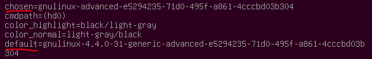

GRUB裡面的環境變數(environment variables)，就像是Unix-like系統一樣，都有個名字，而且是unique的存在，這些變數都可以被set，unset和loooked up。底下介紹一個大概的變數，其中分為兩個部份，第一個部份的變數都對GRUB有特殊的含意，不可以亂用，而第二個部分的變數就可以在組態檔裡面自由的使用。

# Special environment variables

• biosnum:  	
  	當chain-loading到其他的boot loader時，GRUB可能需要知道與root device相關的BIOS drive number，這樣它才可以去設定registers。這部分的話也可以透過命令『devicemap』來達成。

• chosen:  	
  	這個變數需要搭配『GRUB_SAVEDEFAULT』和『GRUB_DEFAULT』的使用，因為設定成會儲存上一次的選擇，才會用到這個變數。底下這張圖可以看到我將
  
  

  
  
• color_highlight:	  	

• color_normal:	  	

• debug:	  	

• default:	  	

• fallback:	  	

• gfxmode:	  	

• gfxpayload:	  	

• gfxterm_font:	  	

• icondir:	  	

• lang:	  	

• locale_dir:	  	

• menu_color_highlight:	  	

• menu_color_normal:	  	

• net_pxe_boot_file:	  	

• net_pxe_dhcp_server_name:	  	

• net_pxe_domain:	  	

• net_pxe_extensionspath:	  	

• net_pxe_hostname:	  	

• net_pxe_ip:	  	

• net_pxe_mac:	  	

• net_pxe_rootpath:	  	

• pager:	  	

• prefix:	  	

• pxe_blksize:	  	

• pxe_default_gateway:	  	

• pxe_default_server:	  	

• root:	  	

• superusers:	  	

• theme:	  	

• timeout:	  	

# The GRUB environment block