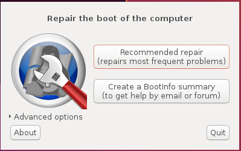
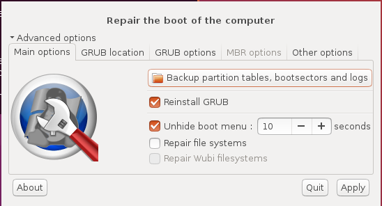

# GRUB2系統救援
我想大部分的人會想要來動到GRUB，通常應該都是因為無法開機了，或者是MBR/GPT的磁區損壞了，這章節會把Ubuntu 社群的相關救援主題整理一下。

# via Boot-Repair Graphical Tool
Boot-Repair是一套可以修復多種GRUB2問題的GUI軟體。這個軟體可以被使用在LiveCD裡, 或將這個軟體自己燒錄成CD-ROM或者是在一般的Ubuntu session上都可以用。

當你在Ubuntu上面遇到開機的問題，或是安裝完其它的Linux dirtros/Windows之類的造成無法開機，安裝完Ubuntu以後Windows無法開機等等，Boot-Repair是最簡單的一套工具可以協助你處理這些疑難雜症。




這套軟體除了可以使用GUI以外，它也有一些進階的功能，像是：<br>
1.可以備份『table partition』。<br>
2.備份『boot sectors』。<br>
3.可以建立Boot-info，Boot-info主要是使用script來收集各種系統的資訊，這些資訊會讓你的問題在社群或是IRC上比較好被辨識。<br>
4.還可以修改預設的repair參數，像是設定GRUB組態，增加kernel options，刪除GRUB，改動預設的OS，回復Windows相容的 MBR，修復損壞的檔案系統，特別指定GRUB要安裝到哪裡等等的資訊。<br>



## 取得Boot-Repair

###方式一
取得Boot-Repair最簡單的方式為建立包含這個工具的disk，像是『[Boot-Repair-Disk](http://sourceforge.net/p/boot-repair-cd/home)』，然後透過這個disk開機就好。建議直接將這個ISO檔燒錄成『live-USB』，製作『live-USB』可以透過工具『[UnetBootin](http://unetbootin.sourceforge.net/)』，『[LiliUSB](http://www.linuxliveusb.com/)』或是『[Universal USB Installer](http://www.pendrivelinux.com/universal-usb-installer-easy-as-1-2-3/)』，如果你的電腦有預先安裝的Win8或是你的boot是EFI模式的話建議不要燒錄成DVD，否則會有問題。

###方式二
1.	從Ubuntu的live-session。
2.	如果你的Ubuntu還可以存取的話，也可以從你的Ubuntu-session。

當然第一，一定要有網路的存取，然後打開terminal，並且輸入底下指令：
```
sudo add-apt-repository ppa:yannubuntu/boot-repair
sudo apt-get update
sudo apt-get install -y boot-repair && boot-repair
```

## 使用 Boot-Repair
1.	啟動Boot-Repair，可使用『Dash』啟動或是直接CMD輸入『boot-repair』。
2.	直接按『Recommended repair』按鈕，系統就會開始幫你處理。
3.	修復完之後，如果有出現一個URL像是『paste.ubuntu.com/XXXXX』，記得先將其記起來，然後重開機，看是否已經解決問題了。
4.	如果還是不能開機，就將上面的URL給論壇或是mail-list上的人，他們也許會幫助你。

# via GRUB2 Rescue mode
GRUB2裡面提供了救援模式，在這個模式底下允許使用者在開機時使用特別的GRUB terminal來修復GRUB2，這部份的建立和使用請參考章節『[Making a GRUB bootable CD-ROM](https://hugh712.gitbooks.io/grub/content/making-a-grub-bootable-cd-rom.html)』。

# via the LiveCD terminal
這個方式主要是利用LiveCD的terminal來修復，所以使用者必須知道他的安裝系統的裝置名稱和partition，然後在從LiveCD上面去掛載。之後GRUB的檔案會在從LiveCD上給複製到適當的位置或是MBR上面去。

這個操作將會將資料給寫到MBR上並且回復所有的modules和core.img到『/boot/grub』裡面，但是並不會置換『grub.cfg』和損壞的檔案，如果想要完全刪除不需要的檔案的話，則GRUB就需要整個被重新安裝。

當你選擇要用LiveCD時，建議最好使用跟你Ubuntu版本一樣的LiveCD，因為GRUB在每個Ubuntu 發佈時的版本都會不一樣。
 
如果你不確定你的Ubuntu是安裝到哪個partition的話，可以使用指令『fdisk』來看，或者是使用指令『blkid』來看也可以，兩個工具的差異主要就是『blkid』的強項就是看有『label』的partition，就看你的需求是什麼摟。

使用底下兩個指令來掛載相關的裝置，然後在將新的GRUB給安裝到相關裝置上：
```
sudo mount /dev/sdXY /mnt 
# Example: 
sudo mount /dev/sda5 /mnt

sudo grub-install --boot-directory=/mnt/boot /dev/sdX 
# Example: 
sudo grub-install --boot-directory=/mnt/boot /dev/sda
```

在上面的兩個指令中，須注意底下的細節：<br>
1.在命令『mount』的後面的參數，請用安裝Ubuntu的partition number。<br>
2.在使用命令『grub-install』後面的參數請勿使用partition number。<br>
3.『X』代表的是磁碟代號，而『Y』代表的是partition number。<br>
4.『--boot-directory』代表的是GRUB所在的路徑，通常是『/boot』，但是如果你的GRUB不是在這個路徑的話請自行指定。<br>
5.如果你的GRUB是在不同的『/boot』partition，則這個partition就應該被掛載到『/mnt/boot』上。<br>


如果你的Ubuntu是安裝在B-tree的file system上，像是btrfs之類的，則請將『/boot』改成『/@/boot』如下：
```
sudo grub-install --boot-directory=/mnt/@/boot /dev/sdX 
# Example: 
sudo grub-install --boot-directory=/mnt/@/boot /dev/sda
```

# via ChRoot
這個方式主要是透過命令『chroot』來存取損壞系統的檔案，如果『chroot』執行成功了，則系統/LiveCD就會把損壞系統的『/』當成自己的，然後在『chroot』改動到的環境都是損壞系統的，而不是LiveCD的。

使用『chroot』的方式可以使用其他Ubuntu系統或是使用LiveCD將損壞系統的硬碟掛載起來，底下的流程則是用LiveCD的案例來講：

(底下所有的例子，『X』是你的磁碟代號，『Y』是partition number。記得要修改成正確的partition)

1.啟動到LiveCD的桌面，LiveCD的位元和損壞的系統位元要一致，32bits 就是對應32bits，64bits則對應64bits。<br>
2.開啟terminal。<br>
3.如果你的系統partitoin是在software RAID上的話，先確定tool -『mdadm』已經安裝在LiveCD的環境上：
```
sudo apt-get install mdadm
```
然後執行底下命令來重組array:
```
sudo mdadm --assemble --scan
```
4.如果使用LVM的話：
```
sudo sh -ec "apt-get install lvm2; vgchange -ay"
```
5.如果使用bcache：
```
sudo sh -ec "apt-get install software-properties-common; 
add-apt-repository ppa:g2p/storage; 
apt-get update; 
apt-get install bcache-tools"
```
6.決定你的系統partition，像之前講過的例子，可以使用下面的命令來查看：
```
sudo fdisk -l
sudo blkid
df -Th
```
7.掛載你的系統partition。
```
sudo mount /dev/sdXY /mnt
#eg.
#Example 1: sudo mount /dev/sda1 /mnt
#Example 2: sudo mount /dev/md1 /mnt
```
8.如果你有個別分開的『boot』partition，就必須要將這個partition給掛載起來：
```
sudo mount /dev/sdXY /mnt/boot

#Example 1: 
sudo mount /dev/sdb6 /mnt/boot

#Example 2: 
sudo mount /dev/md0 /mnt/boot
```
9.配合剛剛第3步，如果你的系統partition是software RAID的話，確定底下這一行指令的輸出是在檔案『/etc/mdadm/mdadm.conf』的array定義。
```
mdadm --examine --scan
```
10.使用底下的指令來掛載『critical virtual filesystems』：
```
for i in /dev /dev/pts /proc /sys /run; do sudo mount -B $i /mnt$i; done
```
11.chroot到你的normal system device
```
sudo chroot /mnt
```
12.重新安裝GRUB2
```
grub-install /dev/sdX
```
13.重新建立GRUB2 menu組態
```
update-grub
```
14.按『CTRL-D』離開chroot。
15.重新開機
```
sudo reboot
```


