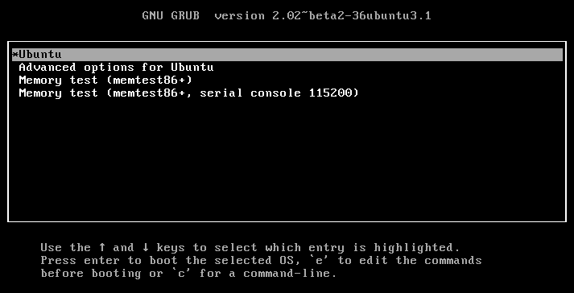

前一章介紹過GRUB和GRUB2的差異，GRUB2的主要功能，根據我的習慣，接下來這一章就要來描繪一下整個GRUB2的大地圖。

(從這一章開始就不特別指名是GRUB或是GRUB2，全部都直接以GRUB來表示GRUB2)

看到上圖，正常的開機流程中，當BIOS/UEFI將控制權交給MBR/GPT中的GRUB後，前兩個重要的步驟就是找到『prefix』和『root』，然後就會使用命令『normal』讀取組態『/boot/grub/grub.cfg』而進入『normal mode』，如果進入normal mode成功的話，所有的命令，檔案系統的模組(file system modules)和一些加解密的模組都會已經自動加載完成才對，當然GRUB的腳本(script) parser也已經ready了。接下來如果要在載入其他的modules的話就可以直接用命令『insmod』。

延續剛才進入『normal mode』後的流程，接下來會根據你的組態來決定是否要到數，是否要用預設的選項開機，是否要顯示『menu entry』等等，通常沒有進入『menu entry的話』就會進入下一階段的開機程序了; 但是如果你有看到如下圖的『menu entry』的話，接下來你有三個選擇可以選：
1. 選擇其一，然後按ENTER以它的設定開機。
2. 選擇其一，按『e』修改既有設定後開機。
3. 直接按『c』進入GRUB的『command line』模式。

另外如果進入『normal mode』失敗的話，就會直接進入『rescue mode(救援模式)』，原因有可能是你的『prefix』是錯的，裝置順序錯誤，甚至也有可能是你的GRUB安裝不正確...等等。

