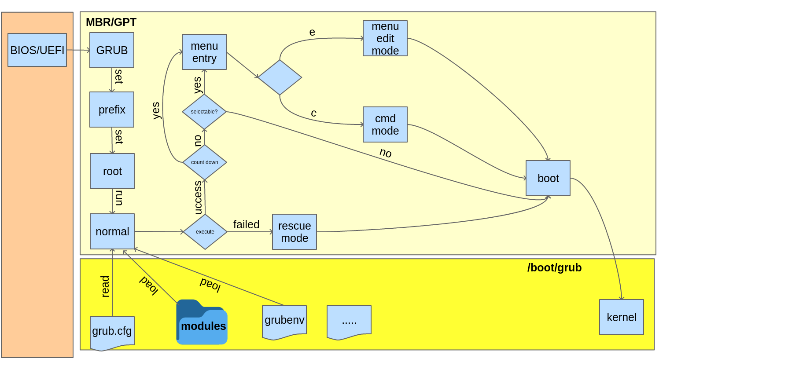

# GRUB的整體流程圖
前一章介紹過GRUB Legacy和GRUB2的差異，還有介紹過GRUB2的主要功能，根據我的習慣，接下來這一章就要來描繪一下整個GRUB2的大地圖。

看到上圖，正常的開機流程中，當BIOS/UEFI將控制權交給MBR/GPT中的GRUB後，前兩個重要的步驟就是找到『prefix』和『root』，然後就會使用命令『normal』讀取組態『/boot/grub/grub.cfg』而進入『normal mode』，如果進入normal mode成功的話，所有的命令，filesystem的modules和一些加解密的modules都會已經自動加載完成才對，而且GRUB的『script parser』也應該已經好了。接下來如果要在載入其他的modules的話就可以直接用命令『insmod』。

延續剛才進入『normal mode』後的流程，接下來會根據你的組態來決定是否要倒數，是否要用預設的選項開機，又是否要顯示『menu entry』等等，通常沒有進入『menu entry的話』就會進入下一階段的開機程序了; 但是如果你有看到如下圖的『menu entry』的話，接下來你有三個選擇可以選：
1. 選擇其一，然後按ENTER以它的設定開機。
2. 選擇其一，按『e』修改既有設定後開機(如下圖二)。
3. 直接按『c』進入GRUB的『command line』模式。

另外如果進入『normal mode』失敗的話，就會直接進入『rescue mode(救援模式)』，原因有可能是你的『prefix』是錯的，裝置順序錯誤，甚至也有可能是你的GRUB安裝不正確...等等。

# GRUB2 的四種操作模式
GRUB2有幾種你可以操控的介面模式(這是我自己分類的，非術語)，大概整理如下：
**1.menu mode**
就是一般大家看到的開機選單，這個模式之下你可以進入『prompt mode
』，也可以直接修改你的menu然後用新的組態開機。
**2.prompt mode**
可以說是『console mode』，是一個GRUB2的文字互動介面，可以由『menu mode』按『c』主動進入這個模式，也有可能是GRUB開機出問題，所以進入這個模式。
**3.rescue mode**
在你的GRUB2系統上的一個預設環境，你可以在這個救援模式底下用文字互動介面來修復你的系統。
**4.system command**
通常是在作業系統底下輔助GRUB2的命令。

# 開機啟動失敗原因
GRUB2在啟動/開機時，有可能會遇到一些問題，而進入不同的模式，畫面上也許也會顯示為什麼失敗的訊息，底下大概列出可能的狀況：

**1.grub>**  
GRUB2已經讀取各個module，也應該已經找到相關的啟動資訊，但是無法找到組態檔，通常是『grub.cfg』，在這個模式底下，大部分的modules和命令都還可以用，如果有些特定的命令不能用的話，就要使用『insmod』來導入相關的modules。

**2.grub rescue>**
代表進入救援模式，出現這個代表GRUB2無法找到資料夾『grub』，或者是無法讀取『normal』modules，在這個模式底下，可以使用的modules和命令有限制，所以如果要用的話，就必須要設定好相對的『prefix』和『root』環境變數，然後在透過『insmod』來導入相關的modules。可藉由指令『normal』來回到標準的『console mode』。

**3.GRUB**
如果只有螢幕左上角有個『GRUB』，但是沒有任何反應的話，代表GRUB2連MBR或是開機磁區的基本資訊都找不到。

**4.Busybox 或是 Initramfs**
GRUB2已經開始開機的流程，但是在轉移控制權給作業系統時發生問題，以至於停在這個階段，有可能是因為錯誤的『UUID』或是『root=』參數，又或者是kernel已經損壞。

**5.Frozen**
如果是在開機過程的畫面中當住(frozen)了，也沒有『grub>』或是『grub rescue』的prompt出現，代表有可能是kernel的video問題，因為這不是GRUB2所造成的問題，所以你還是可以使用GRUB2來修復，這部份的話就需要使用者在menu entry那邊自行調整傳給kernel的參數，然後在啟動試看看。

以上各個GRUB2的啟動失敗流程，都可以用GRUB2的terminal或是直接使用Ubuntu的LiveCD，又或者還有其他相容的第三方軟體來修復。如果你選擇Ubuntu LiveCD的話，建議最好是使用跟你要修復系統同一個版本的LiveCd，會減少許多相容性的問題。

