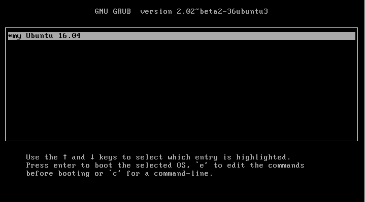

GRUB的multi-boot環境取決於os-prober，也就是在『grub-install』執行以後，GRUB會探測你目前有多少種的kernel和其他作業系統然後幫你輸出到『grub.cfg』裡。

這個章節來介紹一下，怎麼製作一個自製的簡單『multi-boot grub.cfg』:

1. 根據章節『making a grub bootable cd rom』的步驟，先建立相關資料夾，然後在掛載起來的路徑『/mnt/boot/grub/』底下建立一個『grub.cfg』，內容如下：
```
menuentry "my Ubuntu 16.04" {
        set root=(hd0,msdos1)
        linux /vmlinuz root=UUID=8c9eb01d-b58b-4e19-acdb-e1028004a637
        initrd /initrd.img
}
```
2. 然後在將以上的所有內容給建立救援映像檔：<br>

```
grub-mkrescue -o grub.iso iso
```





