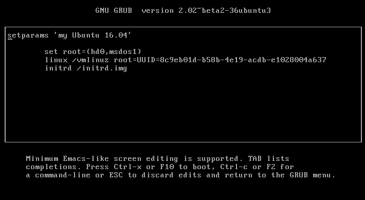

GRUB的multi-boot環境取決於os-prober，也就是在『grub-install』執行以後，GRUB會探測你目前有多少種的kernel和其他作業系統然後幫你輸出到『grub.cfg』裡。

除了Linux和Hurd以外，GRUB2也支援像是FreeBSD，NetBSD和OpenBSD等等的作業系統，並且只要你的作業系統是用multiboot規格去編譯的話，也都可以用GRUB2來開機。

這個章節來介紹一下，怎麼製作一個自製的簡單『grub.cfg』:

1. 根據章節『making a grub bootable cd rom』的步驟，先建立相關資料夾，安裝grub，然後在掛載起來的路徑『/mnt/boot/grub/』底下建立一個『grub.cfg』，內容如下：
```
menuentry "my Ubuntu 16.04" {
        set root=(hd0,msdos1)
        linux /vmlinuz root=UUID=8c9eb01d-b58b-4e19-acdb-e1028004a637
        initrd /initrd.img
}
```
2. 然後在將grub給安裝到目錄下，然後將以上的所有內容給建立救援映像檔：<br>

```
grub-mkrescue -o grub.iso iso
```
接下來將這個映像檔給掛載起來以後重開機，直接看到以下畫面:

按『e』看一下裡面的內容如下:

然後直接按『F10』應該就沒問題可以直接開機了。


FreeBSD

NetBSD

Generic Multi-Boot

Chain Loading
