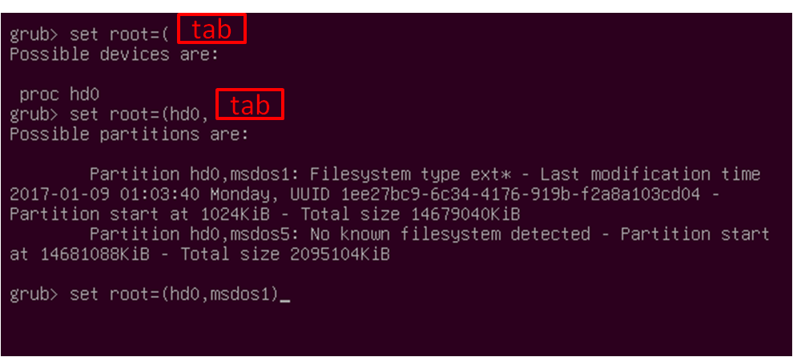
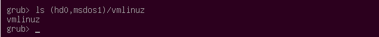

#GRUB的命名規則

GRUB上的裝置名稱有它的特殊語法，所以使用GRUB第一件事，就是要知道這些語法，不然你會不知道如何去找到對的裝置(device)或是分區(partition)。第一個要知道的事，就是GRUB對裝置的描述一定要在成對的小括號『()』裡面，語法描述如下:
```
(device[,partmap-name1part-num1[,partmap-name2part-num2[,...]]])
```

其他裝置名稱的規則描述如下：
- BIOS和EFI使用『fd』或是『hd』然後後面在加一個數字，像是『fd0』。
- AHCI, PATA (ata), crypto和USB使用driver的名稱在加一個編號。
- Memdisk和host則是被限制只能有一個disk，所以只會有一個driver名稱。
- RAID (md), ofdisk (ieee1275 和 nand), LVM (lv), LDM 和 arcdisk (arc)則是使用disk固有的名稱前面在加driver的名稱(只有nand使用別名『nand』，如果有衝突的話就是後面用數字去點綴)，如果語法上有逗號(commas)的話要記得用跳脫字元點綴。
- Loopback則是根據loopback命令上面所使用的名字。
- Hostdisk則是使用在device.map(接下來的章節會介紹)裡面的定義，只要它的格式是『[fhc]d[0-9]*』或是『hostdisk/&lt; OS DEVICE>』；此外，對於crypto和RAID(md)你也可以使用『&lt; driver name>uuid/&lt;uuid>』的語法。

底下列出上面所講解過的device清單:

```
(fd0)
(hd0)
(cd)
(ahci0)
(ata0)
(crypto0)
(usb0)
(cryptouuid/123456789abcdef0123456789abcdef0)
(mduuid/123456789abcdef0123456789abcdef0)
(lv/system-root)
(md/myraid)
(md/0)
(ieee1275/disk2)
(ieee1275//pci@1f\,0/ide@d/disk@2)
(nand)
(memdisk)
(host)
(myloop)
(hostdisk//dev/sda)
```

在來先來看幾個例子:


||
|:--|
||
|`(fd0)`|
|fd代表的是軟碟(floppy disk)，0代表的是磁碟(drive)編號，GRUB的disk number是從0開始，所以這個裝置檔描述代表的是GRUB會用到整個floppy disk。|
|`(hd0,msdos2)`|
|這個例子，hd代表的是硬碟(hard disk drive)，0一樣代表是disk number，所以就是第一顆硬碟。『msdos』代表的是『[partition scheme](https://en.wikipedia.org/wiki/Disk_partitioning)』，2代表的是分區『partition』編號\(又或者是在BSD上的PC slice number\)，之前有說過disk number是從0開始，但是這邊要注意的是，partition number卻是從1開始，所以整個描述就是代表它是第一顆硬碟的第二個partition。|
|`(hd0,msdos5)`|
|上面這個例子代表的是第一顆硬碟的第一個『extended partition』延伸分區，在GRUB裡面要特別注意的是不管你這顆硬碟上前面有多少個『primary partition』，你的『extended partition』的編號還是從5開始，。|
|(tftp)<br>(http)|
|如果你有啟動網路支援的話，可以使用上面兩種的方式存取。|


在GRUB裡面想要存取磁碟或是partition，你都要用相對應的語法來存取，像是底下的兩個範例一樣:

`set root=(fd0)`
`parttool (hd0,msdos3) hidden-`

為方便使用者找到相關的device，GRUB也提供了argument completion，像是底下這個case，你只要按『tab』以後，GRUB就會列出所有的disk，partition甚至是檔案名稱:
<div style="display:none">hugh check</div>


另外一件事要特別注意的是，GRUB並沒有特別區分IDE和SCSI，不管磁碟的介面，都是直接從0開始計算。一般來說，通常IDE介面會比SCSI的號碼還要小，雖然說如果你在BIOS裡面交換你的IDE和SCSI的開機順序的話，並不會直接反映在剛剛的規則上就對了。

所以到這邊我們已經有disk和partition了，接下來就只剩下檔案，看一下底下的例子:



描述的是第一個disk上的第一個partition上的檔案vmlinuz，argument completion也是用在檔案的部分，其實就是把device的部份換成以上所講的格式，其實語法就跟Linux的shell差不多了。

# block lists
有時候有些檔案沒有在任何的檔案系統上，這時候就需要block list的支援，像是如果你要用chainloader的話就要使用block list，語法如下:
```
[offset]+length[,[offset]+length]…
```

```
eg.
0+100,200+1,300+300
```
上面的例子代表GRUB會讀取block 0~99，block 200和 block 300~599，如果你省略offset的話，GRUB會假設offset是0。

其中有一個規則跟檔案名稱語法一樣，如果一個blocklist沒有包含device name的話，則GRUB就會使用root device，所以如果你的root device是『(hd0,2)』，那『(hd0,2)+1』代表的就是『+1』。


