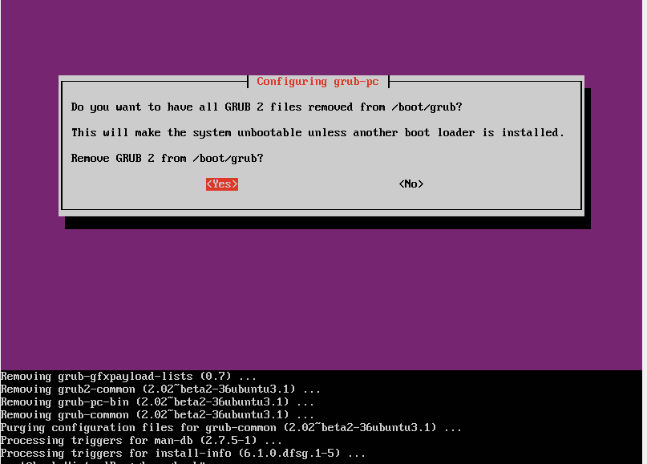

# 完全重新安裝GRUB2

在『grub-install』和『purging & reinstalling』 GRUB之間的差別，主要是後者是可以完全的移除所有GRUB的檔案和系統設定，有些GRUB的錯誤主要是因為舊的組態有問題，檔案損毀，或是檔案/資料夾被不小心刪掉了了等等，所以就算你在安裝在多次，那些有問題的檔案或組態依然存在，如果真的一直有問題的話，就是看看刪除後在重新安裝吧。GRUB套件的刪除和重新安裝的程序包含的『grub-pc』，『grub-common』和『grub-gfxpayload-lists』。

因為這項操作會讓你暫時沒有bootloader，所以請再三確保你在刪除GRUB套件之前你是可以存取網路，並且可以存取相關的repo。想要完全刪除GRUB並且重新安裝的話有兩種方式 - 『Boot-Repair』和『Terminal』，底下有詳細說明。

## via Boot-Repair Graphical Tool
之前的章節有介紹過『Boot-Repair』這套工具，首先當然是一樣先執行它，然後直接選擇『Advanced options』->『GRUB options』->『Purge GRUB and reinstall it』，然後按Apply就好了(我這個版本一開始就已經預設是這個選項)。


## via Terminal Commands
接下來這步驟，不管是在正在運作的Ubuntu或是使用LiveCD來『chroot』都是差不多的，步驟如下：

1.如果你是使用LiveCD的話，請按照『Fixing a Broken System』章節的『chroot』，將你的環境給切到『chroot』底下。
2.假設你已經在『chroot』的環境裡面了，請確保你有網路存取，否則就可以停止了，並且底下的指令都要以『root』來執行。
3.更新apt的資料庫。
```
apt-get update
```
4.底下的指令會完全的移除『grub-pc』和『grub-common』，並且在GRUB 1.99以後會自動移除『grub-gfxpayload-lists』。
```
apt-get purge grub-common
```


5.重新安裝GRUB。
```
apt-get install grub-pc
```
接下來會有提示讓你選你要安裝到那的裝置如下：


6.安裝完畢，如果你是用『chroot』環境的話，可以使用『CTRL-D』離開環境。
7.重新開機。
```
reboot
```

8.一旦你修復你的GRUB，可以開機到作業系統後，可以在由下面兩個指令來更新一下你的組態，並且檢查一下你bootloader的位置。
```
sudo update-grub
grub-probe -t device /boot/grub

```


