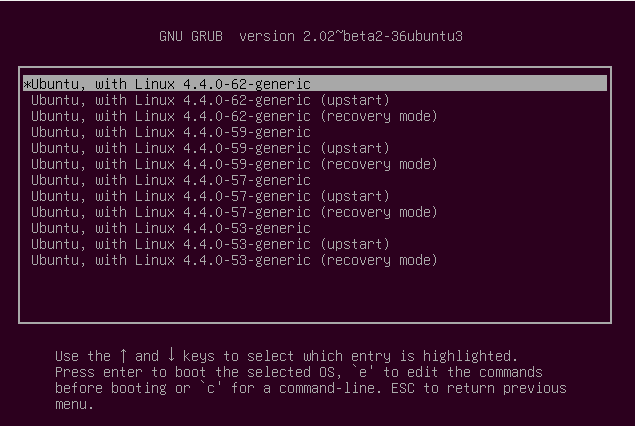
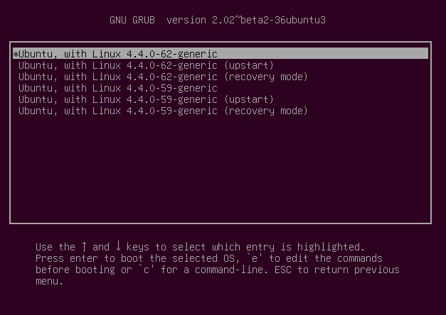

#刪除沒用到的kernel版本

有時候GRUB抓到的kernel清單太多了，這時候你想要清除一些沒用到的kernel，這個章節來介紹一下如何直接用CMD來清除不必要的kernel版本。

1.假設我的電腦有底下這些舊kernel版本。根據我的習慣，我只會留兩個最新的，其他的我會刪除，所以我打算刪除掉『4.4.0-53』和『4.4.0-57』這兩個版本。



2. 列出所有相關『kernel』的dpkg 清單：
使用底下這個指令來看一下相關的kernel
```
dpkg -l | grep "linux"
```
看到主要是以『linux-image』和『linux-headers』為主，
所以你也可以單獨列出:
```
dpkg -l | grep "linux-image"
dpkg -l | grep "linux-headers"
```
如果想要幫你的系統瘦身的話，等一下也可以順便將底下這個『linux-image-extra』刪掉。
```
dpkg -l | grep "linux-image-extra"
```

2.刪除『image』
```
sudo apt-get purge linux-image-4.4.0-53-generic
sudo apt-get purge linux-image-4.4.0-57-generic
```

3.刪除『headers』
```
sudo apt-get purge linux-headers-4.4.0-53
sudo apt-get purge linux-headers-4.4.0-57
```

4.刪除『image-extra』
像剛才說的，如果要瘦身的話，可以刪除舊的『image-extra』，剛好我的電腦裡面有個古董 - 『linux-image-extra-4.4.0-21-generic』
```
sudo apt-get purge linux-image-extra-4.4.0-21-generic
```

5.接下來重開機後，你就可以看到整個清單被瘦身了。<br>

