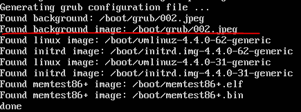
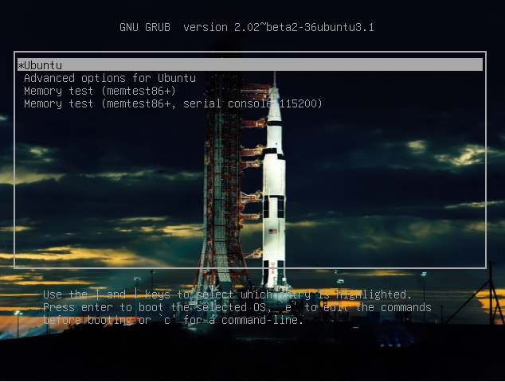

這章主要來講解一下在GRUB2裡面的『splash image』機制，也就是為GRUB2加一個背景圖片(非使用GRUB2 theme)。
# Splash Images

GRUB2的sample splash images都包含在grub2-splashimages套件裡面，要安裝的話可以用下面這個指令：
```
sudo apt-get install grub2-splashimages
```
一旦安裝完了以後，所有的影像檔都會在路徑『/usr/share/images/grub』底下。

(是『grub2-splashimages』不是『grub-splashimages』不要裝錯了！)

## 影像限制
GRUB2背景影像可以使用PNG，JPG/JPEG和TGA格式的影像，除了影像格式以外，還需要有底下的幾個限制:
1. JPG/JPEG必須是8-bit(256色)，否則你會得到如下的訊息『Too many Huffman tables』，如果你不想要被限制只能用256色的話，你就得要用PNG格式的影像。
2. 影像的格式必須是『non-indexed RGB』。
3. 如果你不確定你的影像格式，可以使用軟體GIMP來確認。可以使用選單路徑 Image > Mode ，將properties設定成RGB來確保它不會是Indexed的格式。

## 影像優先權
如果GRUB2有許多適合的影像的可選擇的話，選擇的優先權如底下：
1. 在『/etc/default/grub』底下的『GRUB_BACKGROUND』設定。
2. 第一個在『/boot/grub』裡面找到的影像，檔案格式的順序為『jpg, JPG, jpeg, JPEG, png, PNG, tga, TGA』。如果有多張影像為相同格式/副檔名的話，就會用字母排序。
3. 如果找的到『desktop-base』的話，在『/usr/share/desktop-base/grub_background.sh』裡面指定的桌布。
4. 預設的theme主題，會指定在『/etc/grub.d/05_debian_theme』裡面的『default_theme color』，這部份是沒有影像的。


## 設定影像 (GRUB 1.99 and later)
剛剛講解了怎麼下載相關影像和影像的限制，這一節介紹怎麼設定，主要版本是在GRUB1.99以後。

兩種方式可以加入相關的splash image，第一種是修改GRUB2的組態檔，第二種則是將相關的影像給複製到grub資料夾底下。

### 方法一
1. 編輯檔案『/etc/default/grub』，加入這一行:
```
GRUB_BACKGROUND=/path/filename 
eg. 
GRUB_BACKGROUND="~/Pictures/grubbackround.png"
```
2. 更新『grub.cfg』:
```
sudo update-grub
```

### 方法二
第二種方法是將相關的影像給複製到GRUB資料夾底下，預設的話是『/boot/grub』，如果這個資料夾底下有許多適合的影像的話，GRUB選擇的優先權為:
1. 第一個在『/boot/grub』裡面找到的影像，檔案格式的順序為『jpg, JPG, jpeg, JPEG, png, PNG, tga, TGA』。
2. 如果有多張影像為相同格式/副檔名的話，就會用字母排序。
3. 更新『grub.cfg』:
```
sudo update-grub
```
如果在『update-grup』時有找到相關影像的話，就會出現底下的訊息，但是這邊注意的是，它有抓到影像訊息，不代表這章影像可以用，請注意上面提到過的限制。


然後重新開機後，沒意外的話就會出現相關影像了:



